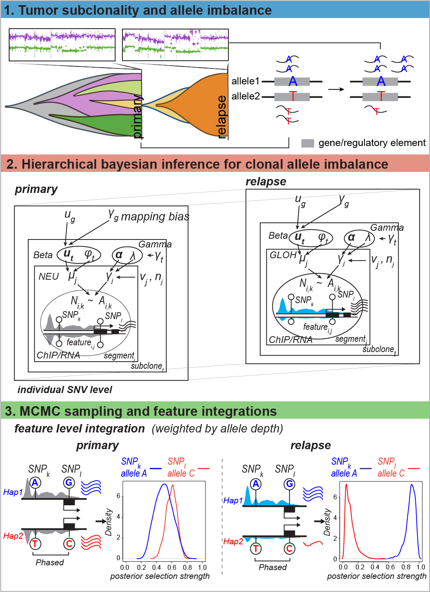

# HBomics: A multiomics data based hierarchical Bayesian framework for clonal allele imbalance inference

## HBomics overview

<figure>

<figcaption aria-hidden="true">HBomics Schematics</figcaption>
</figure>

hierarchical Bayesian model for multiomics data (HBomics) infers
clonal allele imbalance events with known clonal architectures in
a tumor genome. The allele imbalance score for a heterozygous site is
defined as the difference of an allele ratio upon enrichment (e.g., an
expressed allele or an allele enrichment post chromatin
immunoprecipitation) and an allele ratio from the naïve genomic level,
reflecting the selective pressures in the specific genomic regions that
contribute to tumorogenesis and malignancies development. On top of the
correction of genomic allelic copy number variations, HBomics tackles
clonal and regional allele ratio bias and overdispersion by a
hierarchical information sharing strategy that borrows global
information as prior hyperparameters and enables upper-level information
flow across subclonal segments. HBomics can be used for sample-wise
comparison (e.g., primary vs. metastasis/resistant) of allele imbalance
ratio in a site-by-site or feature-by-feature manner, by utilizing
phased SNVs and allele depth-weighted KL divergence scores.

## Installation

    # Install from GitHub
    remotes::install_github("YOUZhen93/HBomics")

## A Quick Start Tutorial

Here is the example of running HBomics with a built-in dummy data set
originated from COLO320-DM/HSR treated with STP.

    # HBomics needs the tumor clonal architectures be build first. The output of a tumor clonal inference tool such as TITANCNA would be good for HBomics framework

    library(HBomics)

    # load the dummy data sets and phased SNVs data frame
    data("meta_d") # meta data of COLO320-DM with mutation_id and feature information
    data("meta_h") # meta data of COLO320-HSR with mutation_id and feature information
    data("data_list_d") # data list of COLO320-DM SNVs information 
    data("data_list_h") # data list of COLO320-HSR SNVs information
    data("phased")  # a dummy phased SNV data frame for this tutorial

    # the data_list as input of HBomics requires the following data:
    names(data_list_d)
    # T: total SNP number (int); 
    # C: total clone & subclone number (int);
    # S: total segment number (int);
    # segment_id: segment id, should be a unique identifier for each segment (array);
    # subclone_id: subclone id, should be a unique identifier for each clone & subclone (array);  
    # n: SNV number of each segment (array);
    # A: alternative allele count of each SNV (array);
    # N: total allele count of each SNV (array);
    # b: genomic allele ratios of each SNV, i.e., genomic allelic copy number ratios from whole-genome/exome sequencing (array);
    # v_t: subclonal genomic variance (array);
    # v_j: segmental genomic variance (array);
    # lambda: Gamma scale parameter (numeric), default is 0.2;
    # mu0: mapping bias from enrichment data (numeric); 1 - mean(ref allele ratio). This ratio should be computed from enrichment data (numeric);
    # sigma0: standard deviation of allele ratios from enrichment data (numeric); 
    # c: median SNV density for segments (int);
    # s: scale parameter in sigmoid function, default is 0.5;

    # 1. Run the main HBomics model

    results_dm <- run_HBomics_pal(
      data_list = data_list_d,
      mutation_id = meta_d$mutation_id,
      meta = meta_d,
      bound = 0.95, # credit intervals for the posterior samples
      chains = 4, 
      iter = 2000, 
      warmup = 1000,
      cores = 10, # use 10 cores to run stan model
      KL = T # posterior samples would be saved if set to TRUE, for the sample-wise KL divergence computation
    )
    ## INFO: Convergence === Global Max R-hat: 1.0155 (Ideal < 1.01)
    ## INFO: Convergence === Global Min ESS:   745

    # This would roughly take 5 min for 10 cores of AMD EPYC 7763 64-Core Processor in Linux environment.
    # User can lower the iteration count for the speed in this walkthrough

    # for COLO320-HSR
    results_hsr <- run_HBomics_pal(
      data_list = data_list_h,
      mutation_id = meta_h$mutation_id,
      meta = meta_h,
      bound = 0.95, # credit intervals for the posterior samples
      chains = 4, 
      iter = 2000, 
      warmup = 1000,
      cores = 10, # use 10 cores to run stan model
      KL = T # posterior samples would be saved if set to TRUE, for the sample-wise KL divergence computation
    )
    ## INFO: Convergence === Global Max R-hat: 1.0094
    ## INFO: Convergence === Global Min ESS:   819

    # the main function returns an HBomicsResult object with allele imbalance summaries
    # and convergence diagnostics; posterior samples are also saved when KL = TRUE
    # checking the output data frame
    head(results_dm$hb_df)  # column mode is the inferred allele imbalance ratio

    # 2. KL divergence computing between samples
    # User can choose comparison on the allele imbalance ratios either site-by-site or feature-by-feature (after running "allele_integ" function)
    # Or Users can use KL divergence to compute the sample-wise difference when they are more concerned about the "shape" between two posterior distributions.
    # Here we demonstrate how to compute KL divergence score on each site between samples
    KL_res = compare_hbomics_kl(obj_C = results_dm, obj_T = results_hsr, symmetric=FALSE)

    head(KL_res)
    # this will generate a data frame with two columns: mutation_id and KL divergence

    # 3. feature-level integration with phased SNVs information
    # To get allele imbalance ratio at gene/regulatory element levels, the user should provide phased SNV information, and HBomics would incorporate the haplotype-aware allele ratio imbalance with an allele depth-weighted strategy, i.e., highly expressed/enriched SNVs will be weighted more in the final allele imbalance ratio
    allele_dm = allele_integ(results_dm, phased = phased, feature = "gene_symbol") # feature argument tells the program which column contains the feature identifier
    allele_hsr = allele_integ(results_hsr, phased = phased, feature = "gene_symbol") 

    # this function generates gene_allele_imb, a data frame with feature-level allele imbalance ratio
    head(allele_dm$gene_allele_imb)
    # total_ar: alternative allele ratio; raw_agg_ar: weighted undirectional allele imbalance ratio; allele_imb: weighted directional allele imbalance ratio (<0 indicates reference allele imbalance)
    # this function also generates an updated HBomics site-level allele imbalance data frame with GT column indicating haplotype
    head(allele_dm$HBomics)

    # If the users would like to use KL divergence at feature levels, they can be computed:
    library(dplyr)
    kl_feature = allele_dm$HBomics %>% right_join(KL_res, by = c("mutation_id")) %>% group_by(gene_symbol) %>% 
    mutate(allele_weights = total_count/sum(total_count), KL_scores_ind = allele_weights* KL_divergence) %>% 
    summarize(KL_scores = sum(KL_scores_ind), .groups = "drop") %>% arrange(desc(KL_scores))

## Citation

Please cite the following paper if you use HBomics:

## Issues

Your feedback is important to us. Please do not hesitate to raise bugs
and suggestions in our github issues.
